layout: false
class: split-75
background-image: url("plots/title_slide_bkg.png")
background-position: center
background-size: contain

<style type="text/css">
.remark-slide-content{
font-size: 30px;

}
code.r{
  font-size: 24px;
}

</style>

```{r setup, include=FALSE}
options(htmltools.dir.version = FALSE, width = 120)
library(tidyverse)
library(knitr)
library(tourr)
library(kableExtra)
library(htmltools)
opts_chunk$set(
  echo = TRUE, warning = FALSE, message = FALSE, comment = "#>",
  fig.path = 'figure/', cache.path = 'cache/', fig.align = 'center',
  fig.width = 12, fig.height = 4, fig.show = 'hold',
  cache = FALSE, external = TRUE, dev = 'png', dev.args = list(bg = "transparent")
)
mp4_vid <- function(src, width){
  HTML(
    paste0(
      '<video width="', width, '" loop autoplay>
        <source src="', src, '" type="video/mp4">
      </video>'
    )
  )
}
```


```{css, echo=FALSE}
/* custom.css */
:root{
  --main-color1: #509e2f;
  --main-color2: #bcbddc;
  --main-color3: #efedf5;
  --main-color4: #9DDAE5;
  --text-color3: black;
  --text-color4: #505050;
  --code-inline-color: #4e5054;
  --link-color: #006CAB;
}
.large { font-size: 150% }
.largeish { font-size: 120% }
.summarystyle { font-size: 150%;
  line-height:150%;}
.my-gray {color: #606060!important; }
.tiny{ font-size: 25%}
```


.column[.content[

<br>

## ** Tours for the dynamic visualization of high-dimensional data**

.my-gray[
.large[**Ursula Laa**]

.largeish[ Institute of Statistics <br>
University of Natural Resources and Life Sciences
]
]

Rencontres R 2021

]]

.column[.top_abs.content[

]]

---

<br>

This talk is based on the recent review paper

<br>

.center[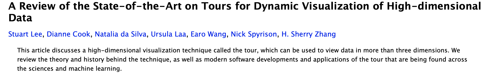]

<br>

with preprint available from https://arxiv.org/abs/2104.08016

---
# Dimensionality of data

When working with *numeric* variables we imagine the data to live in a **Euclidean space** where each *variable* is mapped onto one *axis* spanning the space. Thus, the dimensionality of this space is determined by the number of variables in the data, with each variable adding a new *orthogonal* direction.

.center[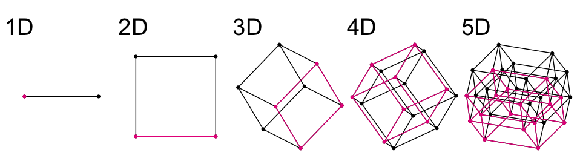]


---
# How can we visualize high-dimensional data?

With up to three variables we can directly map the abstract data space onto our visualization, for example mapping two variables onto the x and y axis for a scatter plot display.

In more than three dimensions we need to find a way of mapping the high-dimensional space onto something that we can draw on our 2D screens.

--

- Dimension reduction
  + Linear projections (scatter plot matrix, PCA, LDA)
  + Non-linear dimension reduction (MDS, t-SNE)
- Parallel coordinate plots
- **Tour methods**

---
# The grand tour and hypercubes

```{r, echo=FALSE, warning=FALSE, message=FALSE, eval=F}
library(tourr)

set.seed(2020)
c4 <- geozoo::cube.iterate(4)
render_gif(c4$points, grand_tour(), display = display_xy(edges = c4$edges, axes = "off"),
            gif_file = "plots/c4.gif")

c6 <- geozoo::cube.iterate(6)
render_gif(c6$points, grand_tour(), display = display_xy(edges = c6$edges, axes = "off"),
            gif_file = "plots/c6.gif")

c3 <- geozoo::cube.iterate(3)
render_gif(c3$points, grand_tour(), display = display_xy(edges = c3$edges, axes = "off"),
            gif_file = "plots/c3.gif")

```

<br>

.center[
<div >
    <div style="width: 33%; float: left">
        <b> 3D </b>
        <a href="">
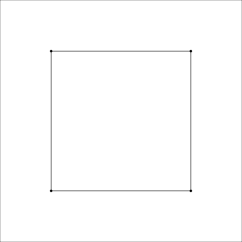
        </a>
    </div>
        <div style="width: 33%; float: left">
       <b>4D</b>
        <a href="">
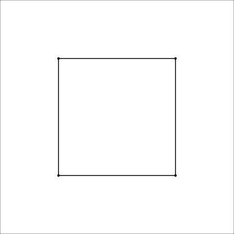        </a>
    </div>
    <div style="width: 33%; float: left">
        <b>6D</b>
        <a href="">
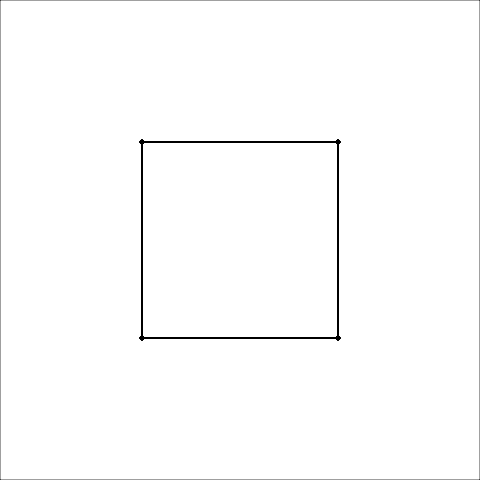        </a>
    </div>
    </div>
]

---
# Grand tour - Notation

We start from our data matrix $X_{n\times p}$, with $p$ variables and $n$ observations, and each view shows the data projected into a $d$-dimensional space (most commonly $d=2$ for a scatter plot display) defined by the projection matrix $A_{p\times d}$. The projected data is denoted $Y = X\cdot A$.

We need three components to generate a tour:

- selection method for target planes $A$
- interpolation method to smoothly rotate the view from the current plane towards the selected target
- display method to draw the projected data $Y$

---
# Tour path

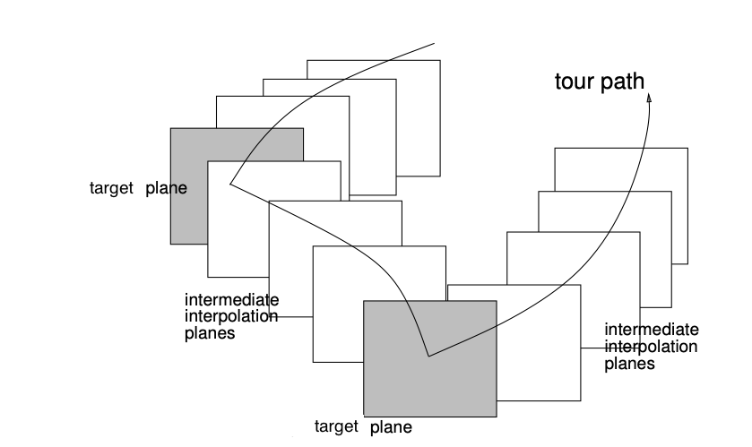

---
# Implementation in R

All three components (with various options) have been implemented in `R` in the `tourr` package.

To get started you can have a look at the [vignette](https://cran.r-project.org/web/packages/tourr/vignettes/tourr.html).

The main function is called `animate`, by default it will show a *grand tour* with 2D projections in a scatter plot display.

```{r, echo=TRUE, warning=FALSE, message=FALSE, eval=FALSE}
library(tourr)
f <- flea[, 1:6]
animate(f)
```

---
class: split-40

.column.content[

<br>

# Implementation in R

<br>

```{r, echo=TRUE, warning=FALSE, message=FALSE, eval=FALSE}
animate(f,
        tour_path = grand_tour(d = 2),
        display = display_xy()
        )
```
]

.column.content[
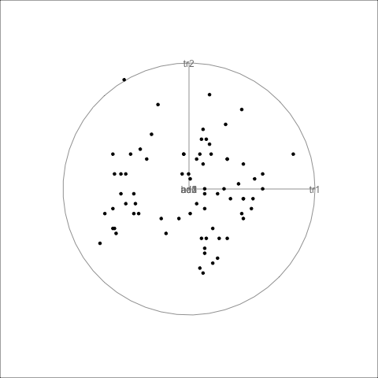
]

---
# Finding targets

In the *grand tour* the target planes are selected randomly from all possible projections. This works well for getting an overview of data as long as $p$ is not too large. Other methods:

- `guided_tour` selects targets that optimize a *projection pursuit index*: we define a measure that indicates the *interestingness* of each projection and only select planes with increasing interestingness along the tour path
- `little_tour` selects axis-parallel projections as targets
- `local_tour` explores a small neighborhood around a selected projection
- `planned_tour` interpolates between a supplied set of target planes

---
class: split-40

.column.content[

<br>

# Guided tour on flea data

<br>

```{r, echo=TRUE, warning=FALSE, message=FALSE, eval=FALSE}
set.seed(2021)
animate(f,
        tour_path = guided_tour(holes()),
        display = display_xy()
        )
```

```{r, echo=FALSE, warning=FALSE, message=FALSE, eval=FALSE}
set.seed(2021)
animation::saveGIF(
  animate(f,
        tour_path = guided_tour(holes()),
        display = display_xy()
        ),  movie.name = "plots/flea_holes.gif")

```

]

.column.content[
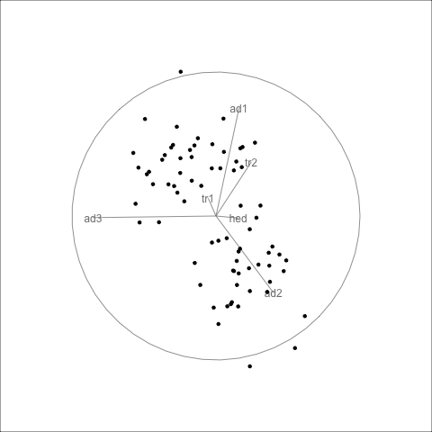
]


---
# Different displays

- When $d=1$ we can use `display_dist` to show a density plot or a histogram. In this case the projection matrix can be given as a bar chart showing the size and direction of how each variable contributes to the current projection.
- When $d=2$ we typically use `display_xy` to show a scatter plot of the projected points. We can extend the display by connecting points via edges (as in the cube examples) or by mapping groups onto color.
- We can also use `display_groupxy` to facet by a grouping variable.
- For larger values of $d$ we can use e.g. `display_scatmat` or `display_pcp`

---
class: split-40

.column.content[

<br>

# 1D

<br>

```{r, echo=TRUE, warning=FALSE, message=FALSE, eval=FALSE}
animate(f,
        tour_path = grand_tour(d = 1),
        display = display_dist()
        )
```
]

.column.content[
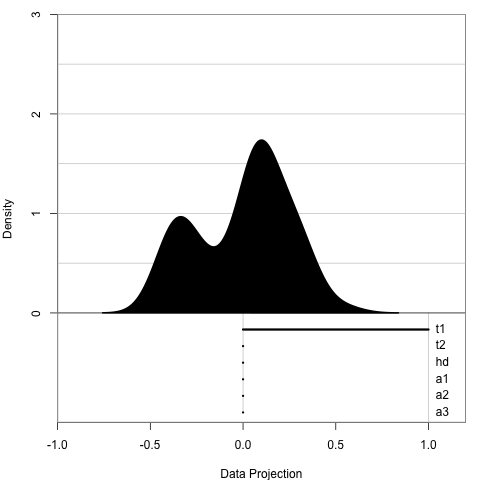
]

---
class: split-40

.column.content[

<br>

# Mapping groups to color

<br>

```{r, echo=TRUE, warning=FALSE, message=FALSE, eval=FALSE}
animate(f,
        tour_path = grand_tour(d = 2),
        display = display_xy(
          col = flea$species
          )
        )
```
]

.column.content[
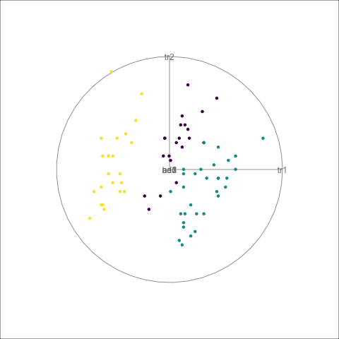
]

---
class: split-40

.column.content[

<br>

# Facetting

<br>

```{r, echo=TRUE, warning=FALSE, message=FALSE, eval=FALSE}
animate(f,
        tour_path = grand_tour(d = 2),
        display = display_groupxy(
          group_by = flea$species,
          col = flea$species
          )
        )
```
]

.column.content[
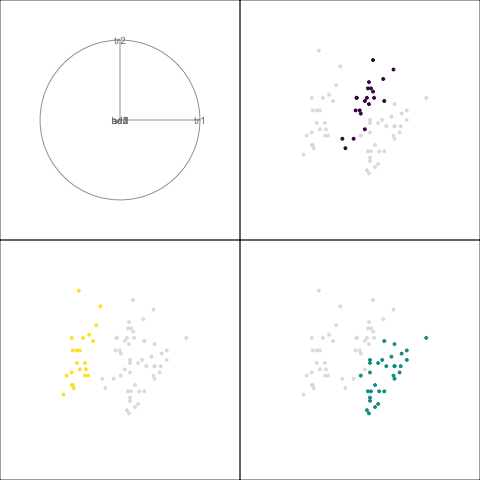
]

---
# New displays for large data

The standard displays are however limited in the case of **large data**:

- Large number of **observations**: overplotting can hide features, especially in the case of concave distributions.
- Large number of **variables**: projected data points tend to fall close to the center (crowding problem)

We have introduced new displays that can address these issues: the **slice tour** highlights points based on a sectioning condition and works well with large $n$ (number of observations). The **sage tour** adjusts resolution based on the distance from the center and corrects for piling effects when $p$ is large.

---
# The slice tour display

For each projection we also use information from the orthogonal space to highlight points close to the centered projection plane. This allows us to see local structures and reveal concave features (e.g. hollowness).

.center[]

---
# Slice tour of geometric shapes

We can combine the slice display with a grand tour to gain intuition about a surface.


.center[
<div >
    <div style="width: 33%; float: left">
        <b> 3D sphere </b>
        <a href="">

        </a>
    </div>
        <div style="width: 33%; float: left">
       <b>4D torus</b>
        <a href="">
        </a>
    </div>
    <div style="width: 33%; float: left">
        <b>Roman surface</b>
        <a href="">
        </a>
    </div>
    </div>
]

---
# Sage tour

The sage display transforms the **radius** (i.e. the distance from the center) of all projected data points such that equal volume in the high-dimensional space gets projected onto equal area in the two-dimensional plane.

Without any transformation the radial distribution of the volume and projected volume of a hypersphere are very different.


.center[
  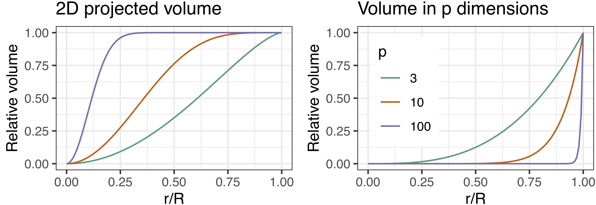
]

---
# Sage tour

The sage display transforms the **radius** (i.e. the distance from the center) of all projected data points such that equal volume in the high-dimensional space gets projected onto equal area in the two-dimensional plane.

We correct for this difference via the radial transformation.


.center[
  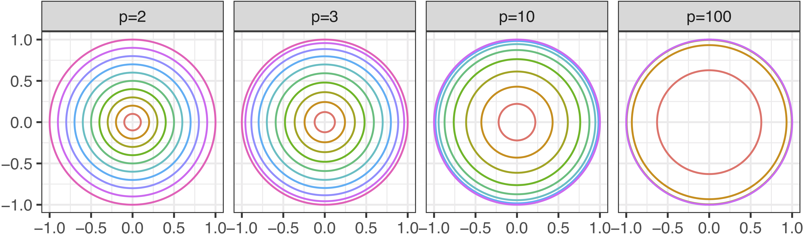
]

---
# Pollen data

We can use the sage display to better resolve small features near the center of a distribution.

  


---
# Some applications

PDFsense examples
Mouse data example
Liminal?

---
# Summary

- Tour methods can visualize high-dimensional data and reveal multivariate structure and outliers, and help us understand grouping
- The `tourr` package includes different methods for basis selection, an algorithm for geodesic interpolation and many display functions
- Since we rely on linear projections, tour displays are straightforward to interpret
- Tours can be used as a complementary method together with non-linear dimension reduction
- These methods can benefit from interactive interfaces, some recent efforts are available in `R` packages: `liminal`, `spinifex` 

